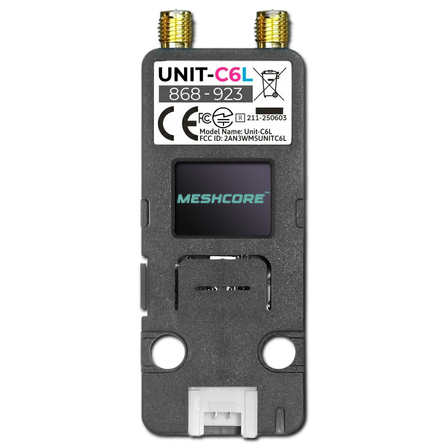

# MeshCore for M5Stack Unit C6L

<p align="center">
  
</p>

Out-of-tree **overlay** + **prebuilt hybrid companion** for the [M5Stack Unit C6L](https://docs.m5stack.com/en/unit/Unit_C6L) (ESP32-C6 + SX1262) on [MeshCore](https://github.com/meshcore-dev/MeshCore).

One firmware image: **BLE + USB + WiFi** (switch Mode on the OLED). This repository does **not** vendor MeshCore’s source tree.

**Pinned MeshCore tag:** `companion-v1.17.1` (see [`COMPAT.json`](COMPAT.json)). “Latest MeshCore” may break patches.

## Quick flash

```bash
git clone https://github.com/gillesbolland/meshcore-m5stack-unit-c6l
cd meshcore-m5stack-unit-c6l
./scripts/flash.sh
```

- **[1] Update** — app only at `0x10000`
- **[2] Full flash** — erase, then merged image at `0x0`
- **[3] Erase only**

Needs [`esptool`](https://docs.espressif.com/projects/esptool/). If missing, the script prints `brew` / `apt` / `pipx` install commands (it does not auto-sudo install).

Download mode: hold Unit C6L **Reset** ~3s. Use a USB data cable.

## WiFi

The published prebuilt has the WiFi Mode UI but **no SSID baked in**. To use WiFi:

1. Rebuild with your network credentials (example `platformio.local.ini` next to MeshCore root after overlay, or pass flags to PlatformIO):

   ```ini
   [env:m5stack_unit_c6l_companion_radio_ble]
   build_flags =
     ${env:m5stack_unit_c6l_companion_radio_ble.build_flags}
     -D WIFI_SSID='"YourNetwork"'
     -D WIFI_PWD='"YourPassword"'
     ; optional: -D TCP_PORT=5000
   ```

   Or rebuild via `./scripts/setup-and-build.sh` after adding those `-D` flags to `overlay/variants/m5stack_unit_c6l/platformio.ini` / a local override.

2. Flash the new companion image (`./scripts/flash.sh`).
3. On the device: **Settings → Interfaces → Mode → WiFi** (device reboots).
4. Open **Settings → Interfaces → WiFi** for `IP:port` (default TCP port **5000**).
5. Connect a MeshCore companion app over TCP to that address.
6. Optional: **USB Debug** keeps USB/CDC while Mode is BLE or WiFi.

Without `WIFI_SSID` at build time, WiFi Mode shows `no SSID` / not connected.

More detail: [`docs/index.html`](docs/index.html).

## What’s in the box

| Path | Purpose |
|------|---------|
| `firmware/` | Prebuilt hybrid companion `.bin` + `-merged.bin` |
| `scripts/flash.sh` | Flash / erase from `firmware/` |
| `scripts/setup-and-build.sh` | Clone pin → overlay → patches → rebuild companion |
| `overlay/` | Variant + SPI OLED driver |
| `patches/` | Small MeshCore hooks |

## Why no MeshCore sources here

Keeps this board port separate from upstream MeshCore history. Users always pull MeshCore themselves at the pinned tag; the setup script overlays files and `git apply`s patches.

## Maintenance

I am **not** committing to heavy ongoing maintenance. **Forks are welcome**; PRs and people who want to continue or take over development are welcome.

## License & credits

- This overlay: **MIT**
- MeshCore: **MIT** — [meshcore-dev/MeshCore](https://github.com/meshcore-dev/MeshCore)
- Hardware: [M5Stack Unit C6L](https://docs.m5stack.com/en/unit/Unit_C6L)
